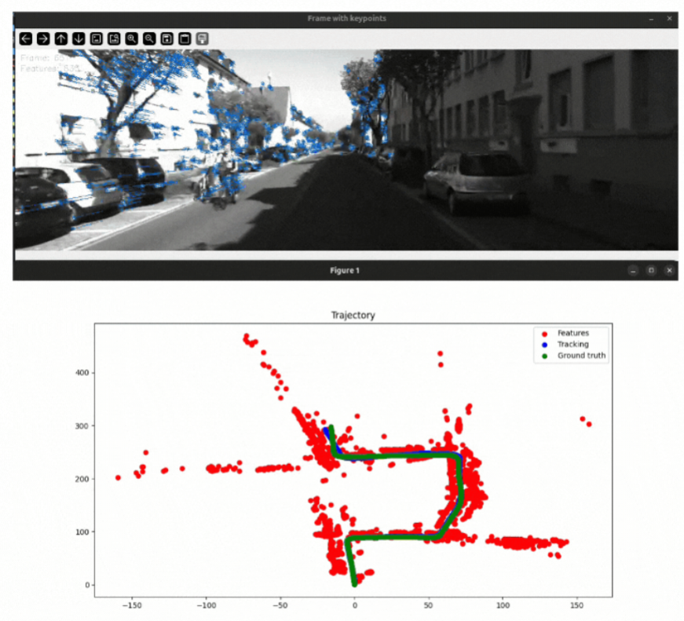

## Monocular Visual Odometry 3D-2D or 2D-2D method.

  

**DatasetReaderKITTI** is responsible for loading frames from [KITTI Visual Odometry Dataset](http://www.cvlibs.net/datasets/kitti/eval_odometry.php) (optionally scaling them to reduce processing time) and ground truth (camera matrix, camera position and scale).

The process begins by converting images to greyscale and detecting keypoints using ORB/SIFT/Edges, etc. These keypoints are then tracked using a FeatureTracker, which can utilize OpenCV's optical flow or a straight forward triangulation but more computational heavy. Outliers located outside the image are removed after tracking. Next step involves estimating the essential matrix (E) to determine the relative pose (R and t) between consecutive frames. Additional outliers are eliminated using RANSAC during this process. Finally, the rotation and translation are used to compute the camera's absolute position and orientation, which are then used to plot its trajectory.
